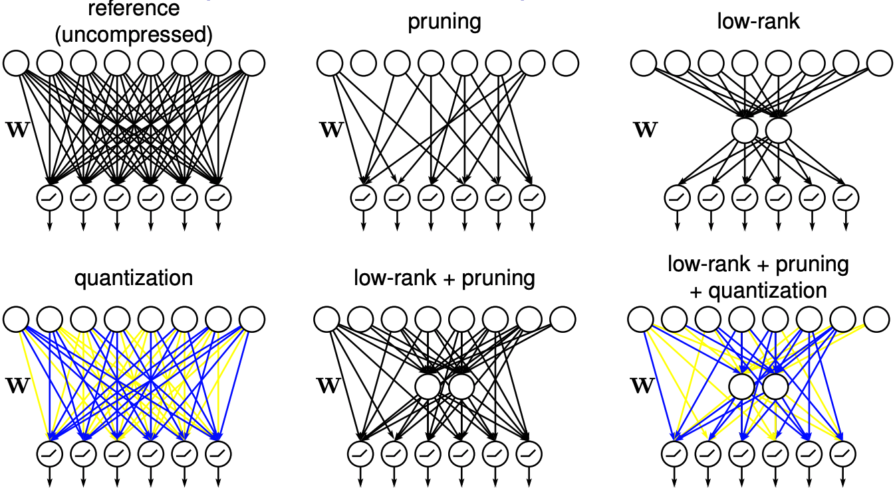
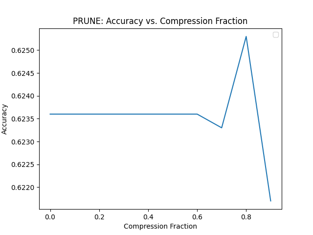
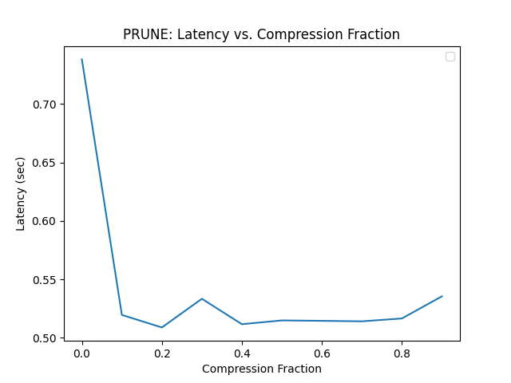
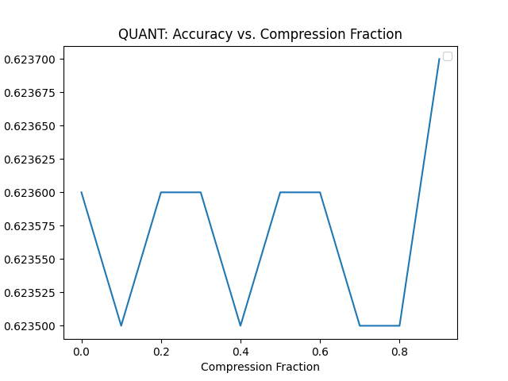
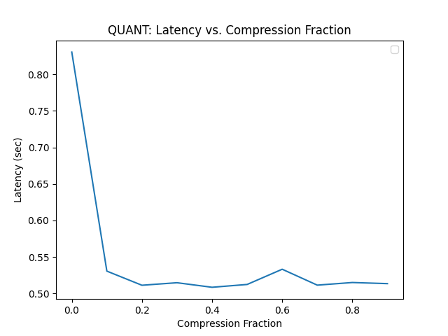
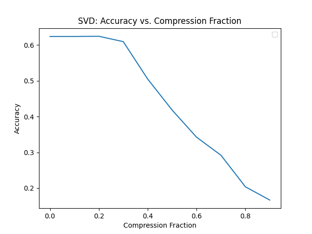
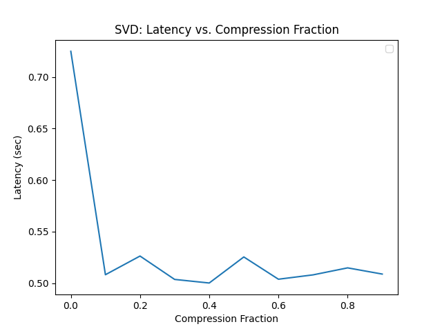

# Neural Network Compression - [Haiku](https://github.com/deepmind/dm-haiku)

Implementation of several neural network compression techniques (pruning, quantization, factorization), in Haiku.

<div align='center'>
  <kbd>
    <a href='http://graduatestudent.ucmerced.edu/yidelbayev/papers/cikm21/cikm21_slides.pdf'>
      
    </a>
  </kbd>
</div>

For an introduction to neural network compression, see [4-popular-model-compression-techniques-explained](https://xailient.com/blog/4-popular-model-compression-techniques-explained).

## Installation

```shell
git clone https://github.com/Brandhsu/nn-compress-haiku/
cd nn-compress-haiku
git lfs pull
pip install -r requirements.txt
```

## Usage

First, train a model on [CIFAR-10](https://www.cs.toronto.edu/~kriz/cifar.html).

```shell
python scripts/01_train.py --save-dir models
```

Then compress it!

```shell
python scripts/02_compress.py --model-path models/params.pkl --compression-func svd --save-dir figs
```

> Note: Compression happens post-training in a layer-by-layer (local) fashion.

## Results

| Type                                       | Description                            | Accuracy                                                   | Latency                                                   |
| ------------------------------------------ | -------------------------------------- | ---------------------------------------------------------- | --------------------------------------------------------- |
| [pruning](nn_compress_haiku/prune.py)      | Prunes weights based on magnitude      | <kbd></kbd> | <kbd></kbd> |
| [quantization](nn_compress_haiku/quant.py) | Linear quantization (uniform sampling) | <kbd></kbd> | <kbd></kbd> |
| [factorization](nn_compress_haiku/svd.py)  | Low-rank reconstruction via SVD        | <kbd></kbd>   | <kbd></kbd>   |

> Note: The results shown are attained on the CIFAR-10 test set with default settings.

Remarks:

- **Accuracy tends to decreases with compression**, however, both linear quantization and weight pruning were fairly robust.
  - This result is interesting because it might suggest that there isn't much linear structure stored in the weights of a neural network, and instead, there are only a small handful of weights responsible for the performance of the neural network.
- **Latency does not decrease with compression** since the number of matrix multiplication operations remain the same (Jax has a [compilation step](https://github.com/google/jax/issues/4495) which may be misleading).
