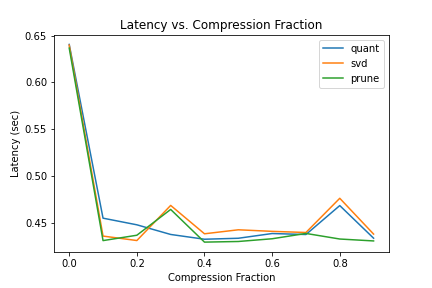

# Neural Network Compression - [Haiku](https://github.com/deepmind/dm-haiku)

Implementation of several neural network compression techniques (knowledge distillation, pruning, quantization, factorization), in Haiku.

<div align='center'>
  <kbd>
    <a href='http://graduatestudent.ucmerced.edu/yidelbayev/papers/cikm21/cikm21_slides.pdf'>
      
    </a>
  </kbd>
</div>

For an introduction to neural network compression, see [4-popular-model-compression-techniques-explained](https://xailient.com/blog/4-popular-model-compression-techniques-explained).

## Installation

[](https://colab.research.google.com/github/Brandhsu/nn-compress-haiku/blob/master/notebooks/nn-compress-haiku.ipynb)

Or install locally:

```shell
git clone https://github.com/Brandhsu/nn-compress-haiku/
cd nn-compress-haiku
git lfs pull
pip install -r requirements.txt
```

## Usage

First, train a model on [CIFAR-10](https://www.cs.toronto.edu/~kriz/cifar.html).

```shell
python scripts/01_train.py --save-dir models
```

_Next, optionally train a model with knowledge distillation._

```shell
python scripts/02_train_kd.py --model-path models/params.pkl --save-dir models
```

Then compress it!

```shell
python scripts/03_compress.py --model-path models/params.pkl --compression-func svd --save-dir figs --log-dir logs
```

> Note: Compression happens post-training in a layer-by-layer (local) fashion.

## Results

The following training checkpoints (non-exponentially averaged) were saved after 10,0001 training iterations.

In this case, simply training a smaller model with supervised labels performed best, followed by training a smaller model with a larger model, and training a larger model with supervised labels.

| Name                                                | Test Accuracy | Latency                                                               | Size     |
| --------------------------------------------------- | ------------- | --------------------------------------------------------------------- | -------- |
| [teacher](models/params.pkl)                        | 62.36%        | 650 ms ± 415 ms per loop (mean ± std. dev. of 7 runs, 10 loops each)  | 121.9 MB |
| [student-alpha-0.0](models/params-kd-alpha-0_0.pkl) | 62.97%        | 423 ms ± 16.4 ms per loop (mean ± std. dev. of 7 runs, 10 loops each) | 295 kB   |
| [student-alpha-0.5](models/params-kd-alpha-0_5.pkl) | 63.24%        | 421 ms ± 4.52 ms per loop (mean ± std. dev. of 7 runs, 10 loops each) | 295 kB   |
| [student-alpha-1.0](models/params-kd-alpha-1_0.pkl) | 63.59%        | 418 ms ± 5.12 ms per loop (mean ± std. dev. of 7 runs, 10 loops each) | 295 kB   |

> Note: These checkpoints were created directly after training and did not undergo any extra compression.

Several other experiments were conducted to measure the impact of post-training compression with respect to accuracy and latency using the following techniques:

- [pruning](nn_compress_haiku/prune.py): masked pruning via weight magnitude
- [quantization](nn_compress_haiku/quant.py): linear quantization via uniform sampling
- [factorization](nn_compress_haiku/svd.py): low-rank reconstruction via svd

| Accuracy                                            | Latency                                            |
| --------------------------------------------------- | -------------------------------------------------- |
| <kbd></kbd> | <kbd></kbd> |

> Note: The results shown are attained with the teacher model on the CIFAR-10 test set.

Remarks:

- **Accuracy tends to decreases with compression**, however, both linear quantization and weight pruning were surprisingly robust.
  - This result is interesting because it might suggest that there isn't much linear structure stored in the weights of a neural network, and instead, a relatively small and sparse subset of weights may be responsible for its overall performance.
- **Latency does not decrease with compression** since the number of matrix multiplication operations remain the same ([JAX](https://github.com/google/jax) has a [compilation step](https://github.com/google/jax/issues/4495) which may be misleading).
  - More work would need to be done to reap the benefits of compression with respect to latency such as factorizing the weights (in the case of svd), sparse matrix formats (in the case of quantization and pruning), sparse computation hardware, etc.).
